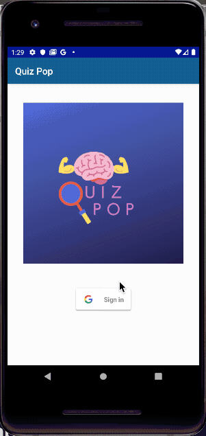

## Welcome to Quiz Pop - An unlimited grab-an-go trivia game.  

###### Developed by: [Joel Bond](https://github.com/bondj89) 

##### Contact information:
- [joelanthonybond@gmail.com](https://www.gmail.com)
- [LinkedIn Profile](https://www.linkedin.com/in/bondcsm/)

#### Application Demo: 

## Introduction 
For this android project, I chose to create a trivia app called Quiz Pop. Since this 
is my first time ever building an app, I wanted it to be a challenging but fun experience. 
My trivia app is simple and consists of multiple choice, true or false type questions of general 
trivia knowledge and is never ending! 

## Description 
Developed in Java, my Native Android app called Quiz Pop is an all you can play 
trivia game that allows players to answer questions from many different popular topics. 
Questions are in the format of multiple choice and true or false. Questions will appear 
on screen and the answers will highlight green once you select your choice. Once the user 
hits the "Next" button at the bottom of the screen, a new question will appear for your 
chance to tackle the next question. 

## Current State of Completion
Current state of my application is fully functional. Orientation is 
locked in Portrait. There are no known bugs at this time. If any errors are received, please perform
a Build -> Clean  and that should resolve any issues. 
 

## Intended Users 
Anyone that loves to play trivia from the palm of their hands. 
This app should appeal to people of all ages who enjoy trivia 
related activities, flexing their brain and competing with friends. 

## Stretch Goals
+ Install a TextView that can convert the html in my question fragment. 
+ Use a Tally or Displayed Percentage so the user can keep score. 
+ Add more organized styling, more specifically for the questions, answers and score.  
+ Options Menu for choosing difficulty or category. 

## Technical requirements & dependencies
- Android API 29
- Pixel 2 Emulator 
- Android Studio 3.4.1
- Gradle 3.2.1

## Instructions for Building the Quiz Pop
1. Clone the repository using the green "Clone or Download" button.  
2. Go to your IDE and choose new project from version control using Git.
3. Paste the url that was copied at the repository but do not open the project. 
4. Instead, import project. 
5. Build with Gradle. Be sure to import any changes from Gradle.
6. When you first create a project, Intellij creates a default run/debug configuration for the main activity. 
7. If there are any errors while building, please Build -> Clean project, then ReBuild. 
8. Be sure to build the app onto a device running a minimum of API 21.(Tested on API Level 29.)

## Instructions for Using Quiz Pop
1. The initial view is the Home screen where the Quiz Pop Logo appears. 
2. To play you must sign in using the Google sign in button below the Quiz Pop logo. 
3. Once signed in, questions will appear. 
4. Make your selection by clicking on your answer. If correct, answer will highlight in green. 
5. Navigate to the next question by clicking on the "Next" button or by using the icons at the top right. 
5. The top navigation bar displays three icons: Next button, Restart button and the Ellipsis button. 
6. When the user is done with the quiz, the user can sign out of the app using the Ellipsis button.   

#### [Javadoc-generated Technical Documentation](https://github.com/bondj89/quiz-pop/tree/master/docs/api)

## External Services Used
This app consumes the following services. 

+ [Google Sign-In](https://developers.google.com/identity/sign-in/android/start-integrating)

+ [OpenTrivia Database](https://opentdb.com/api_config.php/)

## Third Party Libraries

   + [Androidx](https://developer.android.com/jetpack/androidx)
       + [Appcompat](https://developer.android.com/jetpack/androidx/releases/appcompat)
       + [Constraint Layout](https://developer.android.com/reference/android/support/constraint/ConstraintLayout)
       + [Lifecycle](https://developer.android.com/guide/components/activities/activity-lifecycle)
       + [Legacy](https://developer.android.com/jetpack/androidx/releases/legacy)
   + [Androidx Room](https://developer.android.com/jetpack/androidx/releases/room)
       + [Room Runtime](https://source.android.com/devices/tech/dalvik)
       + [Room Compiler](https://source.android.com/setup/build/building)
   + [Google](https://developers.google.com/android)
       + [Android Material](https://material.io/develop/android/)
       + [Android Play Services](https://developers.google.com/android/guides/overview)
       + [Code Gson](https://sites.google.com/site/gson/gson-user-guide)
   + [Reactivex](https://github.com/ReactiveX)
       + [Rxjava](https://github.com/ReactiveX/RxJava)
       + [Rxandroid](https://github.com/ReactiveX/RxAndroid)
   + [Square Up](https://square.github.io/okhttp/)
       + [Picasso](https://square.github.io/picasso/)
       + [Retrofit2](https://square.github.io/retrofit/2.x/retrofit/)
           + [Retrofit](https://square.github.io/retrofit/)
           + [Converter Gson](https://github.com/square/retrofit/tree/master/retrofit-converters/gson)
           + [Adapter Rxjava2](https://github.com/square/retrofit/tree/master/retrofit-adapters/rxjava2)
       + [Okhttps3 Logging Interceptor](https://github.com/square/okhttp/tree/master/okhttp-logging-interceptor)
   + [Facebook Stetho](https://facebook.github.io/stetho/)
 

## Links
+ [User Stories](docs/user-stories.md)

+ [Entity Relationship Diagram](docs/erd.md)

+ [Wireframe Diagram](docs/wireframe.md)

+ [Milestones](docs/milestones.md)

+ [Source Code](docs/sourcecode.md)

+ [Data Definition Language (DDL) for data model](docs/ddl.md)

## Tools 
+ [Lucid Chart](https://www.lucidchart.com/pages/)
+ [Github](https://github.com/bondj89/quiz-pop)
+ [Scrum Board](https://github.com/bondj89/quiz-pop/projects/1)

## Future State of App
The future state of my Android Trivia app is to keep track of games played and display the user's 
score. I would like to add an Options sections so the user can select difficulty and category. If 
that goes well, then I'd like to work on the styling. 

## Copyright & License 

Quiz Pop - Multi-choice, true or false trivia android app. 
Copyright (C) 2019  Joel Bond
    
+ [License](https://github.com/bondj89/quiz-pop/blob/master/LICENSE)
+ [Apache Commons License 2.0](https://www.apache.org/licenses/LICENSE-2.0)

