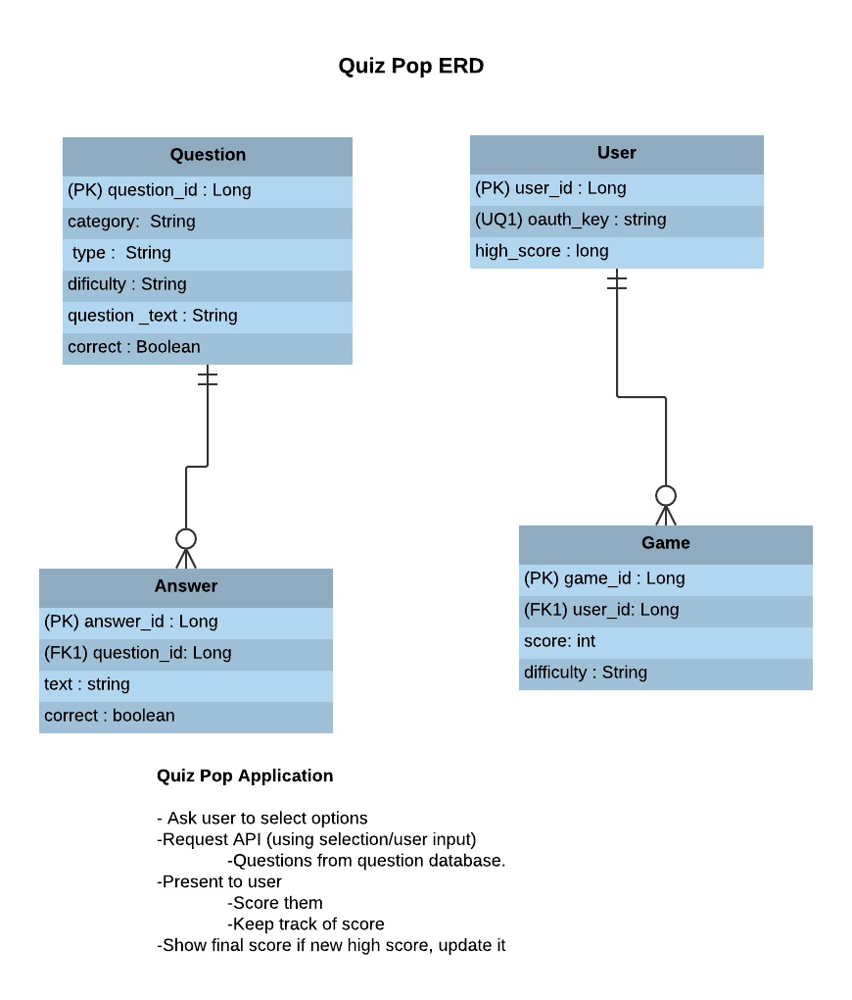

## Entity Relationship Diagram 

### Links to Entity Source Code

[`Question`](https://github.com/bondj89/quiz-pop/blob/master/app/src/main/java/dev/jbond/quizpop/model/entity/Question.java)
[`User`](https://github.com/bondj89/quiz-pop/blob/master/app/src/main/java/dev/jbond/quizpop/model/entity/User.java)
[`Game`](https://github.com/bondj89/quiz-pop/blob/master/app/src/main/java/dev/jbond/quizpop/model/entity/Game.java)
[`Answer`](https://github.com/bondj89/quiz-pop/blob/master/app/src/main/java/dev/jbond/quizpop/model/entity/Answer.java)
